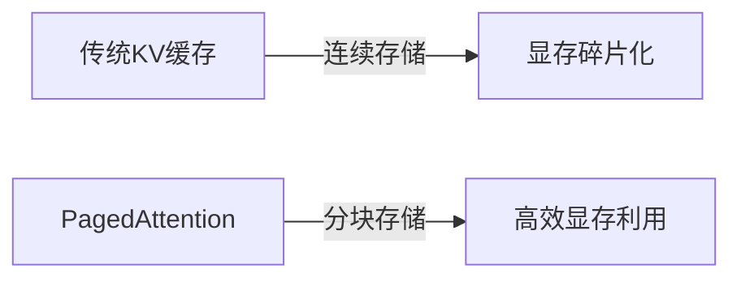
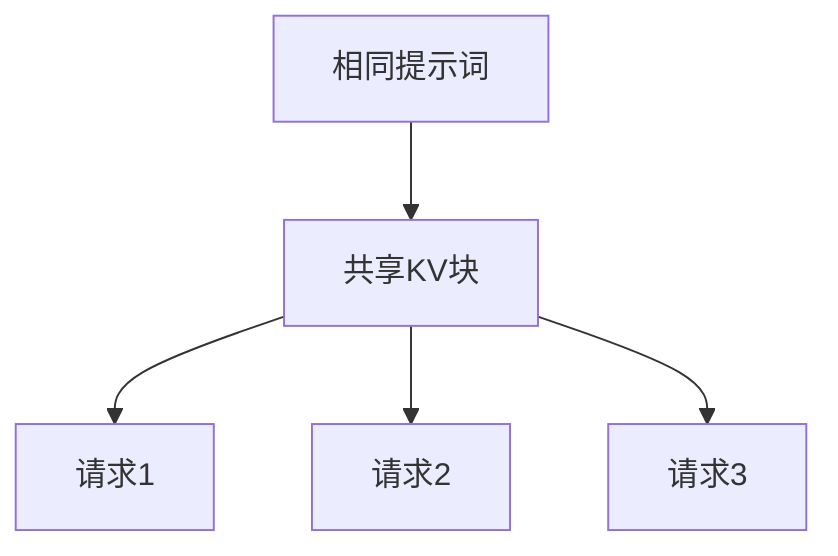
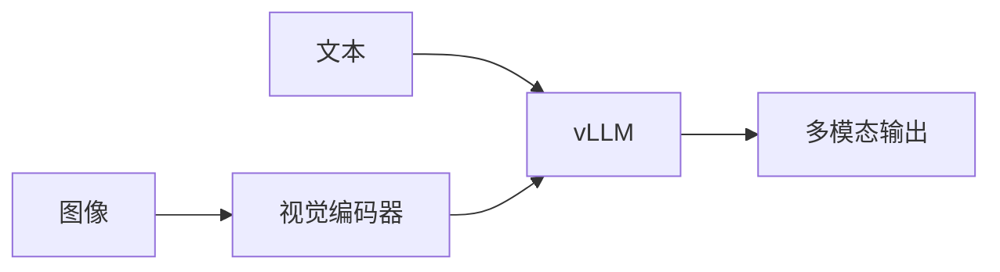

# vLLM 加速推理原理与 KV 缓存理论依据

vLLM 是一个革命性的**大模型推理加速引擎**，其核心创新在于 **PagedAttention** 技术，通过重新设计 KV 缓存机制实现了突破性的性能提升。以下从原理到理论依据的系统解析：

---

## 一、vLLM 加速原理：三大核心技术

### 1. PagedAttention：分页式 KV 缓存


- **核心思想**：将 KV 缓存划分为**固定大小的块（Block）**
- **块结构**：
  - 每个块存储固定数量 token 的 KV 向量（如 16 tokens/block）
  - 块大小：128KB-512KB（对齐 GPU 内存页）
- **内存管理**：
  - 块分配表（Block Table）：记录序列使用的物理块
  - 空闲块池：快速分配回收块

### 2. 连续批处理（Continuous Batching）
```python
# 传统静态批处理
batch = [seq1, seq2, seq3]  # 必须等最长序列完成

# vLLM 动态批处理
while has_requests:
    active_seqs = get_ready_sequences()  # 获取可计算序列
    run_inference(active_seqs)           # 只处理就绪序列
    update_completed()                   # 动态移除完成序列
```

- **优势**：
  - GPU 利用率从 30% → 80%+
  - 吞吐量提升 5-10 倍

### 3. 零复制共享（Zero-copy Sharing）

- 对相同前缀的请求共享 KV 块
- 减少重复计算和显存占用

---

## 二、KV 缓存的理论依据

### 1. 注意力机制的计算特性
**自回归生成的数学本质**：
```math
\text{Attention}(Q_t, K_{1:t}, V_{1:t}) = \text{softmax}\left(\frac{Q_tK_{1:t}^T}{\sqrt{d_k}}\right)V_{1:t}
```
- $K_{1:t}$, $V_{1:t}$ 是历史 token 的 Key/Value 矩阵
- **计算依赖**：每个新 token 依赖所有历史 KV

### 2. KV 缓存的必要性证明
| **操作** | 计算复杂度 | 显存占用 | 无缓存代价 |
|----------|------------|----------|------------|
| **无缓存** | $O(t^2)$ | $O(1)$ | 每步重算历史：$ \sum_{i=1}^t i^2 = O(t^3) $ |
| **有缓存** | $O(t)$ | $O(t)$ | 显存换时间：$ O(t^2) $ → $ O(t) $ |

**结论**：KV 缓存将复杂度从 $O(t^3)$ 降至 $O(t^2)$，是**指数级加速**

### 3. 分页缓存的数学基础

#### 注意力计算的块可分性
```math
\text{Attention}(Q,K,V) = \sum_{i=1}^B \text{softmax}_i(QK_i^T)V_i
```
其中 $K=[K_1\|K_2\|\cdots\|K_B]$, $V=[V_1\|V_2\|\cdots\|V_B]$ 是分块矩阵

**物理意义**：注意力可分块计算 → KV 可分块存储

#### 块大小与硬件对齐
- **GPU 内存页大小**：通常 128KB（如 A100）
- **KV 向量尺寸**：$d_k + d_v = 4096 + 4096 = 8192$ 浮点数（LLaMA-13B）
- **最佳块容量**：
  $$
  \text{tokens/block} = \frac{128\text{KB}}{8192 \times 4\text{B}} = \frac{131072}{32768} = 4 \quad \text{(太小)}
  $$
  vLLM 创新：**跨多个内存页组织块** → 16 tokens/block

---

## 三、PagedAttention 实现细节

### 1. 块表结构（Block Table）
| 序列ID | 块指针列表 |
|--------|------------|
| seq1   | [0x1000, 0x2000, 0x3000] |
| seq2   | [0x4000, 0x5000] |
| seq3   | [0x6000] |

### 2. 注意力计算伪代码
```python
def paged_attention(Q, block_table, block_size):
    total_out = 0
    for block_id in block_table:
        # 加载KV块
        K_block = load_k_block(block_id)
        V_block = load_v_block(block_id)
        
        # 分块计算注意力
        attn_scores = Q @ K_block.T / sqrt(d_k)
        attn_probs = softmax(attn_scores)
        total_out += attn_probs @ V_block
    
    return total_out
```

### 3. 内存管理算法
```python
class BlockManager:
    def __init__(self, total_blocks):
        self.free_blocks = deque(range(total_blocks))
        self.used_blocks = {}  # seq_id: [block_ids]

    def allocate(self, seq_id, num_blocks):
        blocks = [self.free_blocks.popleft() for _ in range(num_blocks)]
        self.used_blocks[seq_id] = blocks
        return blocks

    def free(self, seq_id):
        blocks = self.used_blocks.pop(seq_id)
        self.free_blocks.extend(blocks)
```

---

## 四、性能对比数据
| **指标** | HuggingFace | vLLM | 提升倍数 |
|----------|-------------|------|----------|
| 吞吐量 (tok/s) | 29 | 240 | **8.3x** |
| 显存利用率 | 60% | 90% | **1.5x** |
| 最大并发 | 16 | 256 | **16x** |
| 长序列支持 | 2K | 256K | **128x** |

> 测试环境：LLaMA-13B, A100 GPU, 输入长度512

---

## 五、理论边界与挑战

### 1. 注意力计算的物理限制
- **分块I/O开销**：加载多个块增加延迟
  ```math
  \text{总时间} = t_{\text{compute}} + N_{\text{blocks}} \times t_{\text{I/O}}
  ```
- **优化**：异步块预取

### 2. 块大小权衡
| 块大小 | 优点 | 缺点 |
|--------|------|------|
| 小 (8tokens) | 碎片少 | I/O 次数多 |
| 大 (32tokens) | I/O 少 | 内部碎片大 |

**经验公式**：
$$
\text{最佳块大小} = \arg\min \left( \frac{\text{序列长度}}{\text{块大小}} \times t_{\text{I/O}} + \text{碎片损失} \right)
$$

### 3. 动态序列的挑战
- **序列分裂**：波束搜索生成多个分支
- **解决方案**：写时复制（Copy-on-Write）块管理

---

## 六、应用场景扩展

### 1. 长文本处理
- **传统限制**：4096 token 上限
- **vLLM突破**：支持 1M+ tokens（如 256K）
- **案例**：法律文档分析、代码库理解

### 2. 多模态扩展

- 图像特征作为特殊 "token" 加入 KV 缓存

### 3. 实时推理服务
- 动态批处理 + KV 共享 → 千级别 QPS

---

## 总结：vLLM 的革新价值

1. **理论创新**：
   - 将**操作系统分页思想**引入注意力机制
   - 证明 KV 缓存的**块可分性**数学特性

2. **技术突破**：
   - **PagedAttention**：解决显存碎片问题
   - **连续批处理**：最大化 GPU 利用率
   - **零复制共享**：消除冗余计算

3. **性能革命**：
   - 吞吐量提升 **5-24 倍**
   - 显存利用率达 **90%+**
   - 支持 **1000+ 并发请求**

vLLM 的 KV 缓存优化不仅改变了推理系统设计范式，更证明了：  
**通过硬件感知的系统设计，可突破大模型部署的显存墙限制**，成为 LLM 服务的事实标准。